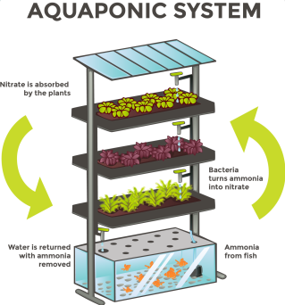

# Aquaponics

This section documents information regarding Aquaponics and the benefits it provides in conjunction with Hydroponics. The information is supplied in support of establishing a Aquaponics/Hydroponics facility inside of the DKAL main facility.

## Defining Aquaponics

**Aquaponics** is conventionally a system of sheltered environments for fish and other aquatic animals. It is used to extract nutrients from the waste produced by these creatures. The nutrients can be used for various purposes, but their most common use is to support the self-sufficiency of Hydroponics.

## Supplementing Hydroponics

 Aquaponics is a closed loop system which allows growing fish and plants together with complete self-sufficiency.

### Process

Water from a fish tank is pumped into a flood tank, where the ammonia rich waste produced by the fish is properly mixed. This fertiliser serves as a source of nutrients for the plants stacked over the fish tank.

 

## Benefits

The following are the key benefits of using an Aquaponics system:

1. No fertilisers are required.
2. The water is recycled continuously rather than being lost to the soil.
3. No pesticides or herbicides are required.

## Challenges

## Contemporary Applications

## Aquaponics vs Hydroponics
