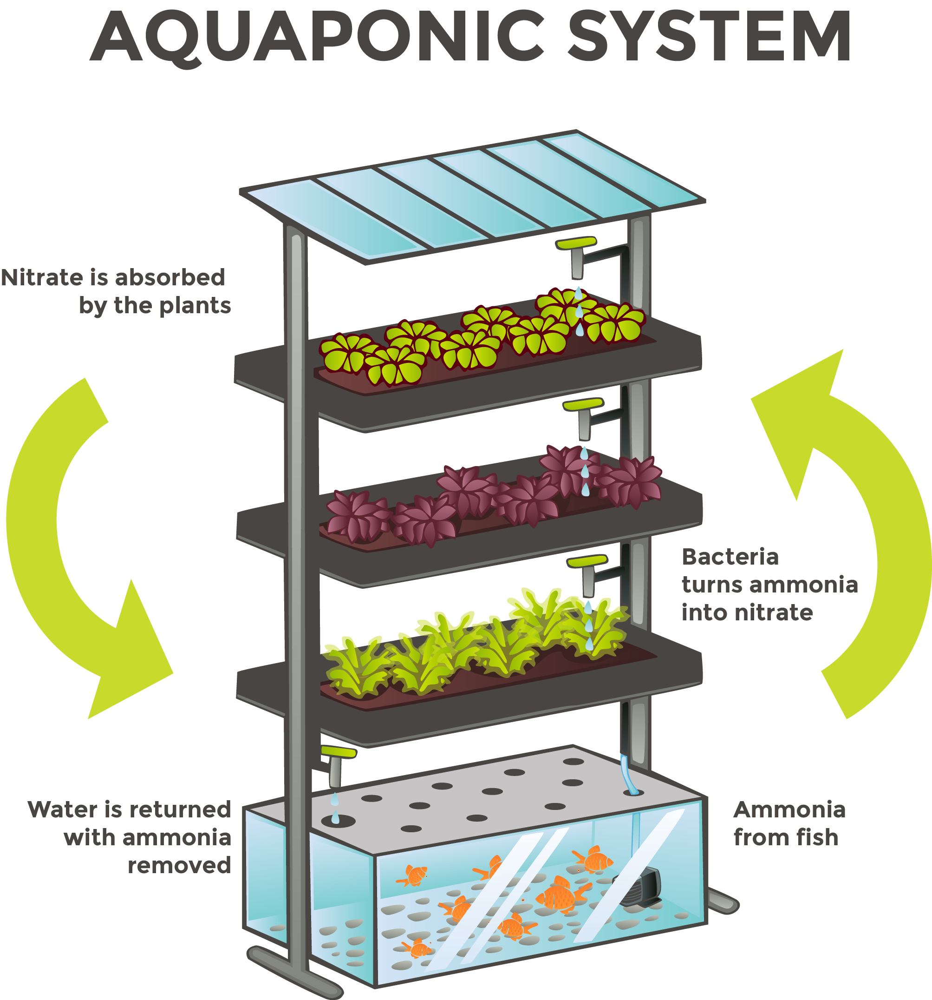

# Aquaponics

This section documents information regarding Aquaponics and the benefits it provides in conjunction with Hydroponics. The information is supplied in support of establishing a Aquaponics/Hydroponics facility inside of the DKAL main facility.

## Defining Aquaponics

**Aquaponics** is conventionally a system of sheltered environments for fish and other aquatic animals. It is used to extract nutrients from the waste produced by these creatures. The nutrients can be used for various purposes, but their most common use is to support the self-sufficiency of Hydroponics.

## Supplementing Hydroponics

{:height="50%" width="50%"}

## Benefits

## Challenges

## Contemporary Applications

## Aquaponics vs Hydroponics
